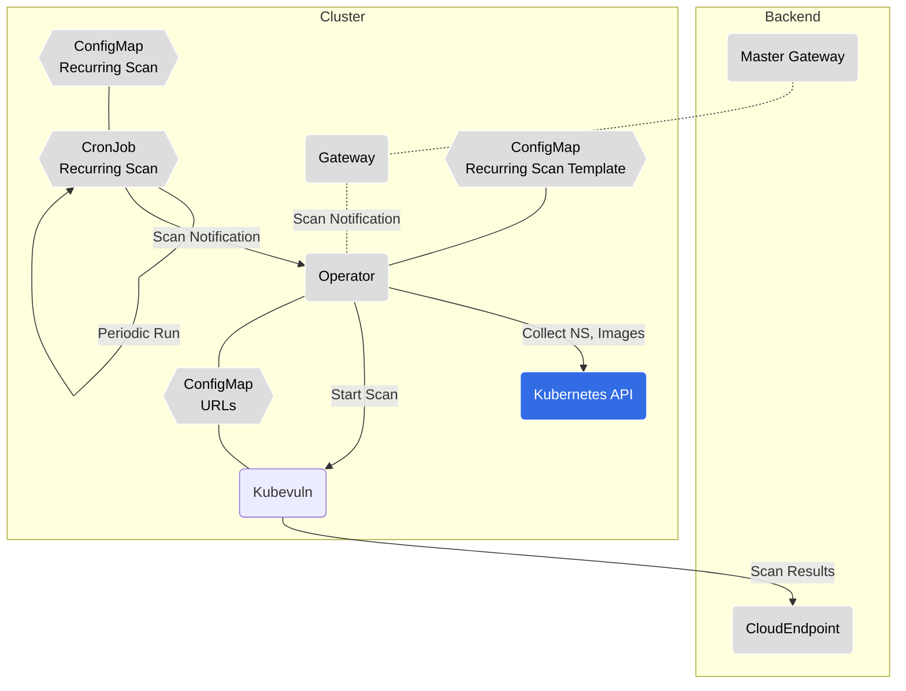

# weebhook



```mermaid
graph TB
  subgraph Cluster
    gw(Gateway)
    operator(Operator)
    k8sApi(Kubernetes API)
    kubevuln(Kubevuln)
    ks(Kubescape)
    urlCm[ConfigMap<br>URLs]
    recurringTempCm[ConfigMap<br>Recur. Scan Template]
    recurringScanCj[CronJob<br>Recurring Scan]
  end
   masterGw(Master Gateway) -.-> gw
    gw ---> operator
    recurringScanCj -.-> operator
    operator --> ks
    operator --> kubevuln
    operator --> k8sApi
    operator --- urlCm
    operator --- recurringTempCm

  classDef k8s fill:#326ce5,stroke:#fff,stroke-width:1px,color:#fff;
  classDef plain fill:#ddd,stroke:#fff,stroke-width:1px,color:#000;
  class k8sApi k8s
  class ks,gw,masterGw,urlCm,recurringScanCj,recurringTempCm,kubevuln plain
  ```
```mermaid
graph TB
  subgraph Cluster
    gw(Gateway)
    operator(Operator)
    k8sApi(Kubernetes API);
    kubevuln(Kubevuln)
    ks(Kubescape)
    urlCm{{ConfigMap<br>URLs}}
    recurringTempCm{{ConfigMap<br>Recur. Scan Template}}
    recurringScanCj{{CronJob<br>Recurring Scan}}
  end;
   masterGw(Master Gateway) .- gw
    gw ---> operator
    recurringScanCj ---> operator
    recurringScanCj --> recurringScanCj
    operator -->|scan cluster| ks
    operator -->|scan images| kubevuln
    operator --> k8sApi
    operator --- urlCm
    operator --- recurringTempCm
  
  classDef k8s fill:#326ce5,stroke:#fff,stroke-width:1px,color:#fff;
  classDef plain fill:#ddd,stroke:#fff,stroke-width:1px,color:#000;
  class k8sApi k8s
  class ks,gw,masterGw,kollector,urlCm,recurringScanCj,recurringTempCm,kubevuln,er,dashboard plain
```
