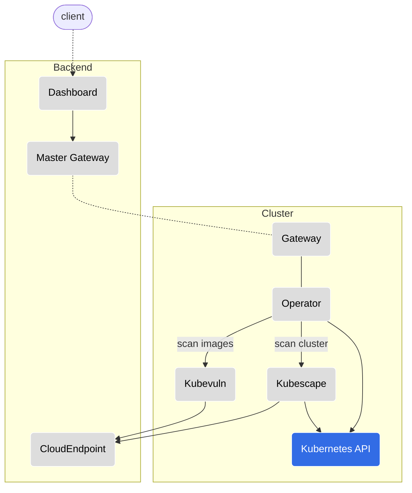
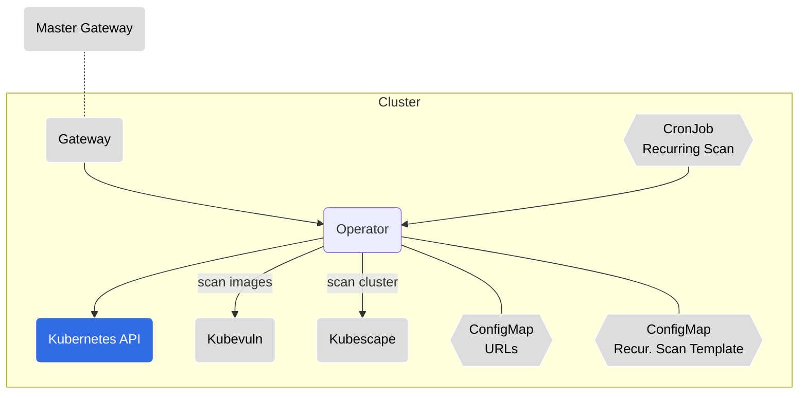
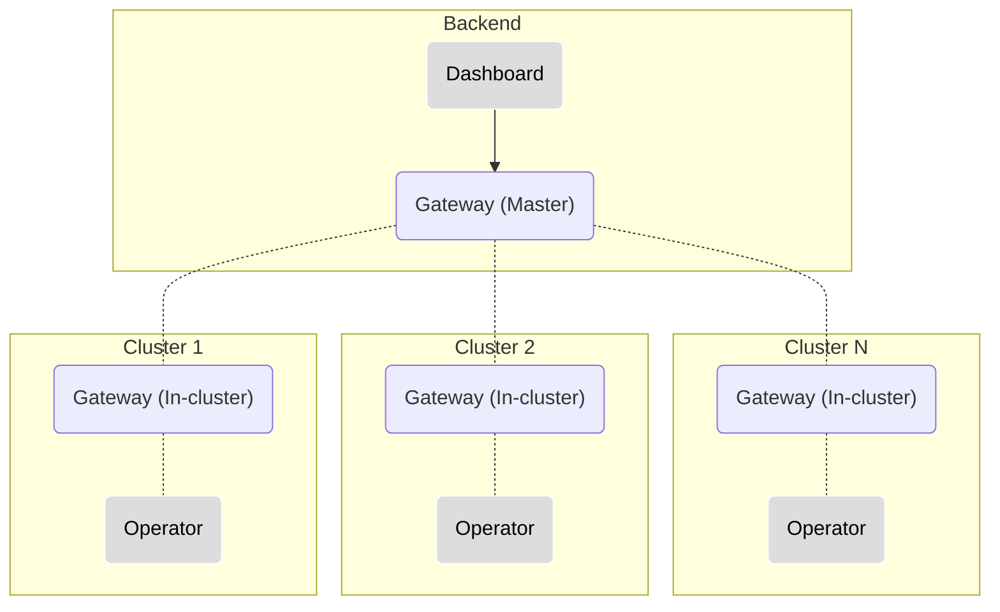
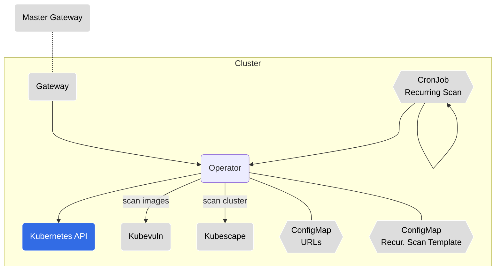

# In-cluster components overview

An overview of each in-cluster component which is part of the Kubescape platform helm chart.
Follow the repository link for in-depth information on a specific component.

## High-level Architecture Diagram

  

---

## [Operator](https://github.com/kubescape/operator)

* __Resource Kind:__ `Deployment`
* __Communication:__ REST API, Websocket
* __Responsibility:__ The Operator component is at the heart of the solution as it is the triggering engine for the different actions in the cluster; It responds to REST API requests and messages received over websocket connection, and triggers the relevant action in the cluster. Such actions could be triggering a configuration scan, image vulnerability scan, defining a recurring scan (by creating CronJobs), etc.

Component Diagram1

---

## [Gateway](https://github.com/kubescape/gateway)

* __Resource Kind:__ `Deployment`
* __Communication:__ REST API, Websocket
* __Responsibility:__ Broadcasts a message received to its registered clients. When a client registers itself in a Gateway it must provide a set of attributes, which will serve as identification, for message routing purposes.

  In our architecture, the Gateway acts both as a server and a client, depending on its running configuration:
  * Master Gateway: Refers to the instance running in the backend. Broadcasts messages to all of its registered Gateways.
  * In-cluster Gateway: Refers to the instance running in the cluster. Registered to the Master Gateway using a websocket; Broadcasts messages to the different in-cluster components, this enables executing actions in runtime.

  A Master Gateway communicates with multiple in-cluster Gateways, hence it is able to communicate with multiple clusters.

Component Diagram

---

---
---

